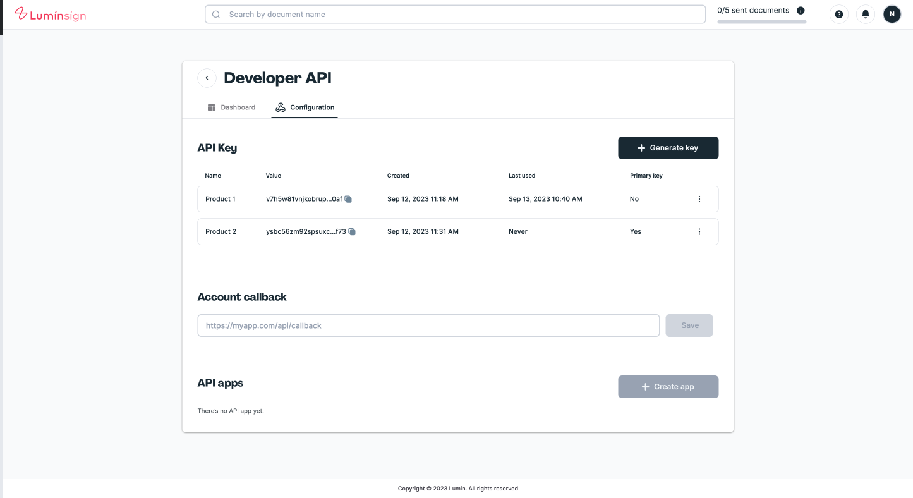

You can authenticate with the Lumin Sign API by using an API key
## API Key
API key is the most common method for authenticating against Lumin Sign API. You can retrieve keys from the [Developer Settings page](https://sign-staging.luminpdf.com/developer/configuration) in the Lumin Sign Dashboard.

API keys need to be kept secret and should only be used from your own backend. **Never expose your API key in any public spaces such as GitHub public gist/repositories**.

API keys are long-lived and do not expire.

Authentication to the API is performed in two ways: using **X-API-KEY** or with [HTTP Basic Auth](https://en.wikipedia.org/wiki/Basic_access_authentication).

### X-API-KEY
```bash
API_KEY=my_simple_api_key
curl -XGET -H 'X-API-KEY: ${API_KEY}' 'https://api-staging.luminpdf.com/v1/user/info'
```
### Basic Auth
Provide your API key as the basic auth username value. You don't need to provide a password (Note: Don't forget the trailing **":"** after the API key):
```bash
API_KEY=my_simple_api_key
curl -XGET 'https://api-staging.luminpdf.com/v1/user/info' -u "${API_KEY}:"
```

## Multiple API Keys
Lumin Sign allow you to create multiple API Keys for your account.

Each account may have up to four API keys at a time. All keys are **"active"** and can be used to call the Lumin Sign API.

Only one key can be set as the **Primary Key**. The **Primary Key** is used to generate the *signature*, which serves to [verify event payload from webhooks](/docs/api/events/#signature-verification).



## Rotate API Key

You can rotate API Key by generate a new key at [Developer Settings page](https://sign-staging.luminpdf.com/developer/configuration). The old keys will continue to work until you delete them.

You should generate new ones if there’s any chance they’ve been exposed or compromised.

We recommend rotating your API key at least every 6 months.

:::caution
Do NOT delete your old API keys until you have confirmed the new keys work as expected.

If you want to change **Primary Key**, you need to ensure that your *signature* verification process is updated to use the new key.
:::