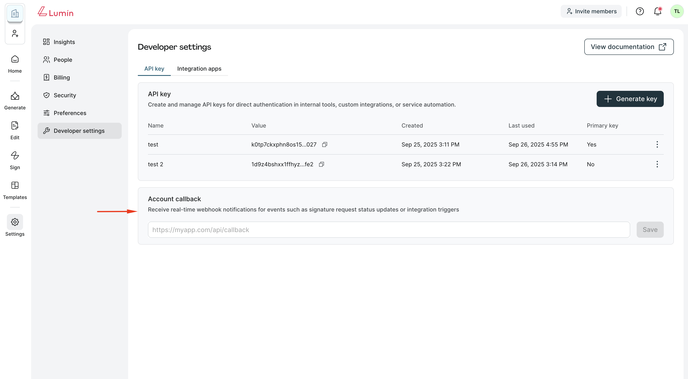

Lumin Sign Events (aka "webhooks), which are payloads of event metadata automatically sent to your app when something happens in Lumin Sign.

## Account callbacks

**Account Callbacks** notify your app when an event happens involving your account by sending the event payload to your account callback url.

The **Account Callbacks** can be configured on the [Developer Settings page](https://sign-staging.luminpdf.com/developer/configuration).



## Callback Request

### Event Payload

Event payloads always include an *event* field, which contains basic information about the event that occurred.

Event payloads may include information about the event occurred:

```js
{
  "event" : {
    "event_time": 1694664207595,
    "event_type": "signature_request_sent", //  the name of the specific event that occurred
    ...
  },
  "signature_request": {
    "signature_request_id": "fa5c8a0b0f492d768749333ad6fcc214c111e967",
    "title": "My first request",
    "is_complete": false,
    ...
  }
}
```

## Securing Callbacks

### Signature Verification

We provide a couple of headers on callback requests:

**User-Agent**: Sender agent. Always `Lumin Sign API`

**X-Signature**: A hex digest SHA256 signature of the request's JSON payload, generated using your [Primary API key](/docs/api/authentication/#multiple-api-keys)

```bash title="Example X-Signature"
api_key='my_primary_api_key'
json='{"event": { "event_time": 1694664207595, "event_type": "signature_request_sent" }, "signature_request": { "signature_request_id": "fa5c8a0b0f492d768749333ad6fcc214c111e967", "title": "My first request" } }'

echo -n $json | openssl dgst -sha256 -hmac $api_key (X-Signature = 3810cb411041efab279d31698b9584372e5ede9d1641fbb354810f16e51be81c)
```

## Failures and Retries

Our requests will timeout after 30 seconds, so callbacks will fail if your server takes longer than that to respond.

The retry pattern is described below:

| Retry           | Delay After Previous Attempt |
| ------------- | -------------------------- |
| First        | 5 minutes
| Second       | 15 minutes
| Third    | 45 minutes
| Fourth  | 2 hours 15 minutes
| Fifth | 6 hours 45 minutes
| Sixth | 20 hours 15 minutes

## Event Names

Here is a list of webhook events that can be sent to your callback urls:

| Event Name | Description | Attached API object |
| ------------- | ------------- | ------------- |
| `signature_request_created` | The signature request is created successfully | [Signature Request](/api/get-signature-request/) |
| `signature_request_viewed` | A signer opens the document | [Signature Request](/api/get-signature-request/) |
| `signature_request_approved` | The document has been signed by all signers | [Signature Request](/api/get-signature-request/) |
| `signature_request_declined` | A signer declines the document. This will turn the `status` of the `signature_request` to `REJECTED` | [Signature Request](/api/get-signature-request/) |
| `signature_request_signed` | The document has been signed by a signer | [Signature Request](/api/get-signature-request/) |
| `signature_request_invalid` | An error occurred while processing the signature request data on our back-end i.e. invalid text tags | [Signature Request Error](/api/get-signature-request/) |