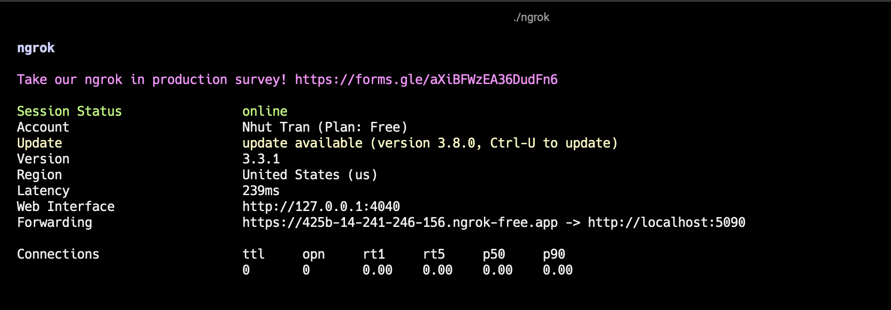
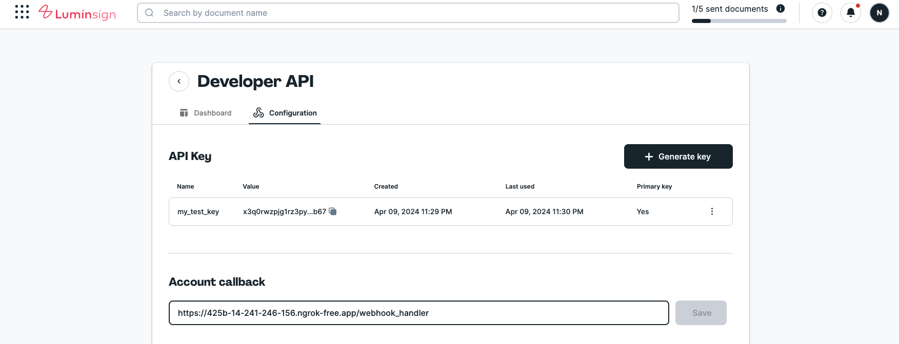
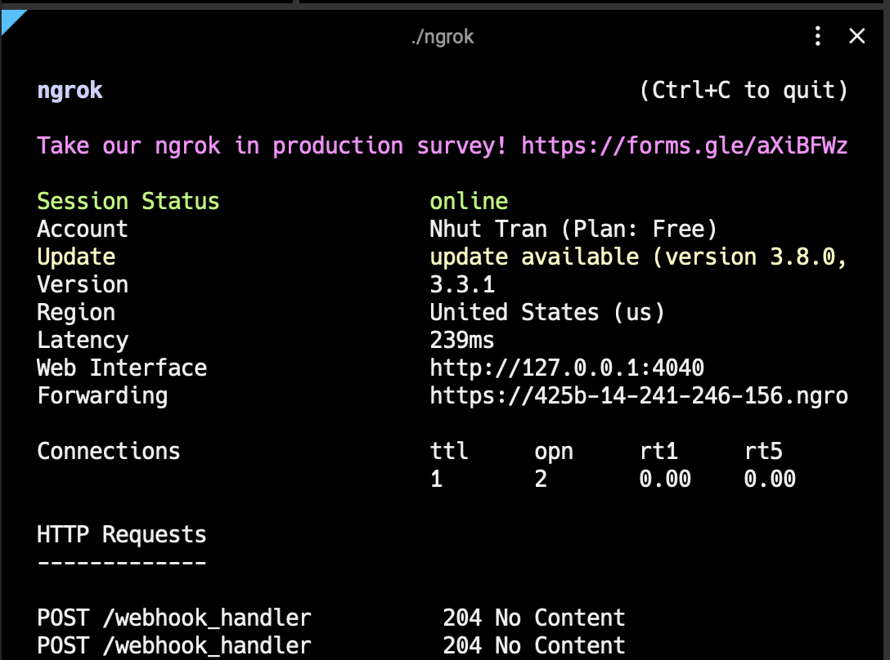

Lumin Sign events (aka "webhooks") are payloads of event metadata automatically sent to your system when something happens in Lumin Sign.

## Account callbacks

**Account Callbacks** notify your system when an event happens involving your account by sending the event payload to your account callback url.

The **Account Callbacks** can be configured on the [Developer Settings page](https://sign.luminpdf.com/developer/configuration).


## Callback Request

### Event Payload

Event payloads always include an *event* field, which contains basic information about the event that occurred.

Event payloads may include information about the event occurred:

```js
{
  "event" : {
    "event_time": 1694664207595,
    "event_type": "signature_request_sent", //  the name of the specific event that occurred
    ...
  },
  "signature_request": {
    "signature_request_id": "fa5c8a0b0f492d768749333ad6fcc214c111e967",
    "title": "My first request",
    "is_complete": false,
    ...
  }
}
```

## Securing Callbacks

### Signature Verification

We provide a couple of headers on callback requests:

**User-Agent**: Sender agent. Always `Lumin Sign API`

**X-Signature**: A hex digest SHA256 signature of the request's JSON payload, generated using your [Primary API key](/docs/api/authentication/#multiple-api-keys)

```bash title="Example X-Signature"
api_key='my_primary_api_key'
json='{"event": { "event_time": 1694664207595, "event_type": "signature_request_sent" }, "signature_request": { "signature_request_id": "fa5c8a0b0f492d768749333ad6fcc214c111e967", "title": "My first request" } }'

echo -n $json | openssl dgst -sha256 -hmac $api_key (X-Signature = 3810cb411041efab279d31698b9584372e5ede9d1641fbb354810f16e51be81c)
```

## Failures and Retries

Our requests will timeout after 30 seconds, so callbacks will fail if your server takes longer than that to respond.

The retry pattern is described below:

| Retry           | Delay After Previous Attempt |
| ------------- | -------------------------- |
| First        | 5 minutes
| Second       | 15 minutes
| Third    | 45 minutes
| Fourth  | 2 hours 15 minutes
| Fifth | 6 hours 45 minutes
| Sixth | 20 hours 15 minutes

## Event Names

Here is a list of webhook events that can be sent to your callback urls:

| Event Name | Description | Attached API object |
| ------------- | ------------- | ------------- |
| `signature_request_created` | The signature request is created successfully | [Signature Request](/api/get-signature-request/) |
| `signature_request_viewed` | A signer opens the document | [Signature Request](/api/get-signature-request/) |
| `signature_request_approved` | The document has been signed by all signers | [Signature Request](/api/get-signature-request/) |
| `signature_request_declined` | A signer declines the document. This will turn the `status` of the `signature_request` to `REJECTED` | [Signature Request](/api/get-signature-request/) |
| `signature_request_signed` | The document has been signed by a signer | [Signature Request](/api/get-signature-request/) |
| `signature_request_invalid` | An error occurred while processing the signature request data on our back-end i.e. invalid text tags | [Signature Request Error](/api/get-signature-request/) |
| `signature_request_canceled` | The signature request is canceled | [Signature Request Error](/api/get-signature-request/) |
| `signature_request_cancel_failed` | The signature request cancelation failed | [Signature Request Error](/api/get-signature-request/) |

## Testing Webhooks Locally with ngrok
Webhooks require a publicly accessible URL to receive HTTP requests, which poses a problem during local development. Ngrok addresses this by creating a secure tunnel to your local server. This section will guide you through setting up ngrok and using it to test webhooks locally.

### Step 1: Installing ngrok
Install ngrok by following the instructions on the [ngrok website](https://ngrok.com/docs/getting-started/).

### Step 2: Starting a Local Server

Before using ngrok, ensure your application is running locally on a specific port. For example, if you're developing a web application that listens on port `5090`, ensure the application is accessible via `http://localhost:<PORT>`.

### Step 3: Creating a Secure Tunnel with ngrok
To expose your local server to the Internet, use ngrok to create a secure tunnel to the port your application is running on:

```bash
ngrok http 5090
```

You will see something similar to the following console UI in your terminal.


Replace `5090` with the port number your local server is using. ngrok will start and display the session's information in your terminal, including the public URL(s) that ngrok has generated for your local server (e.g., `https://<random>.ngrok.io`).

### Step 4: Configuring the Webhook URL

At [Developer Settings page](https://sign.luminpdf.com/developer/configuration), set the Account Callback URL to the ngrok URL generated in the previous step.

For example, if the ngrok URL is `https://425b-14-241-246-156.ngrok-free.app` and your webhook handler path is `/webhook_handler`, set the Account Callback URL to `https://425b-14-241-246-156.ngrok-free.app/webhook_handler`.



### Step 5: Testing the Webhook
You can now test the webhook by triggering an event that would cause the webhook to be sent.

For example, if you're testing the `signature_request_created` event, create a new signature request in Lumin Sign and you will see something similar to the following console UI in your terminal.



