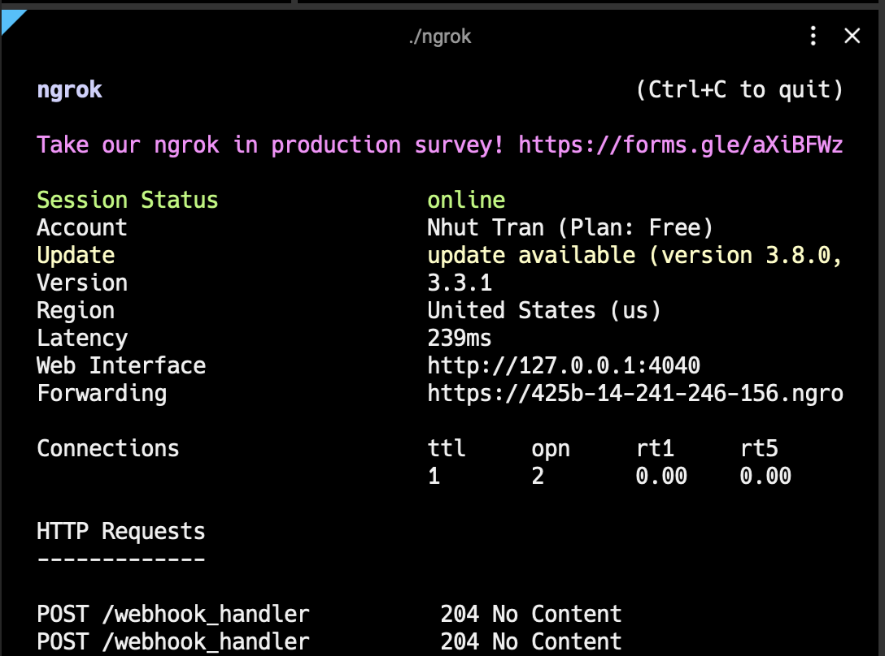

# Test Webhooks with ngrok

Webhooks require a publicly accessible URL to receive HTTP requests, which poses a problem during local development. **ngrok** addresses this by creating a secure tunnel to your local server. This guide will walk you through setting up ngrok and using it to test webhooks locally.

## Prerequisites

Before testing webhooks locally, ensure you have:

- A local web server running (e.g., Express.js, Flask, Django, etc.)
- An ngrok account (free tier available)
- Your webhook endpoint implemented and ready to receive requests

## Step 1: Installing **ngrok**

Install ngrok by following the instructions on the [ngrok website](https://ngrok.com/docs/getting-started/).

## Step 2: Starting a local server

Before using ngrok, ensure your application is running locally on a specific port. For example, if you're developing a web application that listens on port `3000`, ensure the application is accessible via `http://localhost:3000`.

### Example: Express.js server

```javascript
const express = require('express');
const app = express();

app.use(express.json());

// Webhook endpoint
app.post('/webhook', (req, res) => {
  console.log('Webhook received:', req.body);
  res.status(200).json({ status: 'success' });
});

const PORT = process.env.PORT || 3000;
app.listen(PORT, () => {
  console.log(`Server running on port ${PORT}`);
});
```

## Step 3: Creating a secure tunnel with ngrok

To expose your local server to the Internet, use ngrok to create a secure tunnel to the port your application is running on:

```bash
ngrok http 3000
```

You will see something similar to the following console UI in your terminal.


Replace `3000` with the port number your local server is using. ngrok will start and display the session's information in your terminal, including the public URL(s) that ngrok has generated for your local server (e.g., ` https://reinaldo-unglorifying.ngrok-free.dev`).

### Important notes

- **HTTPS URL**: Always use the HTTPS URL (not HTTP) for your webhook endpoint
- **Session duration**: Free ngrok sessions expire after 2 hours
- **URL changes**: Each time you restart ngrok, you'll get a new URL

## Step 4: Configuring the Webhook URL

1. Go to **Developer Settings page → API Key tab → Account callback section**.
2. Set the Account Callback URL to your ngrok URL
3. Click **Save** button.

For example, if the ngrok URL is `https://reinaldo-unglorifying.ngrok-free.dev` and your webhook handler path is `/webhook`, set the Account Callback URL to `https://reinaldo-unglorifying.ngrok-free.dev/webhook`.


## Step 5: Testing the webhook

You can now test the webhook by triggering an event that would cause the webhook to be sent.

For example, if you're testing the `signature_request_created` event:

1. Create a new signature request in Lumin Sign
2. Watch your terminal for the webhook request
3. You should see the webhook payload logged in your console




## Webhook payload example

When testing, you'll receive payloads like this:

```json
{
  "event": {
    "event_time": 1758812613960,
    "event_type": "signature_request_created",
    "event_metadata": {
      "signer_email": "test@luminpdf.com",
      "workspace_id": "68d417..."
    }
  },
  "signature_request": {
    "signature_request_id": "68d559...",
    "title": "Test webhook",
    "created_at": 1758812612210,
    "updated_at": 1758812612248,
    "expires_at": 1827510980694,
    "status": "NEED_TO_SIGN",
    "signers": [
      {
        "name": "Signer 1",
        "email": "signer1@luminpdf.com",
        "status": "NEED_TO_SIGN",
        "is_approved": false
      },
      {
        "name": "Signer 2",
        "email": "signer2@luminpdf.com",
        "status": "NEED_TO_SIGN",
        "is_approved": false
      }
    ],
    "details_url": "https://sign.luminpdf.com/auth?mode=view-contract&token=8647b0..."
  }
}
```

## Troubleshooting

### Common issues

**Webhook not received:**
- Check that your local server is running
- Verify the ngrok tunnel is active
- Ensure the webhook URL is correctly configured
- Check that the webhook endpoint returns HTTP 200

**ngrok session expired:**
- Restart ngrok to get a new URL
- Update your webhook configuration with the new URL
- Consider upgrading to a paid ngrok plan for longer sessions

**SSL/TLS errors:**
- Always use the HTTPS URL from ngrok
- Ensure your webhook endpoint can handle HTTPS requests

## Next steps

Once you've successfully tested webhooks locally:

1. **Deploy to production**: Set up your webhook endpoint on a production server
2. **Configure production webhook**: Update your webhook URL to point to production
3. **Monitor webhook delivery**: Set up monitoring and alerting for webhook failures

See **[Account Webhooks](/docs/api/webhooks/account-callbacks)** for details on configuring Account-level callbacks.
