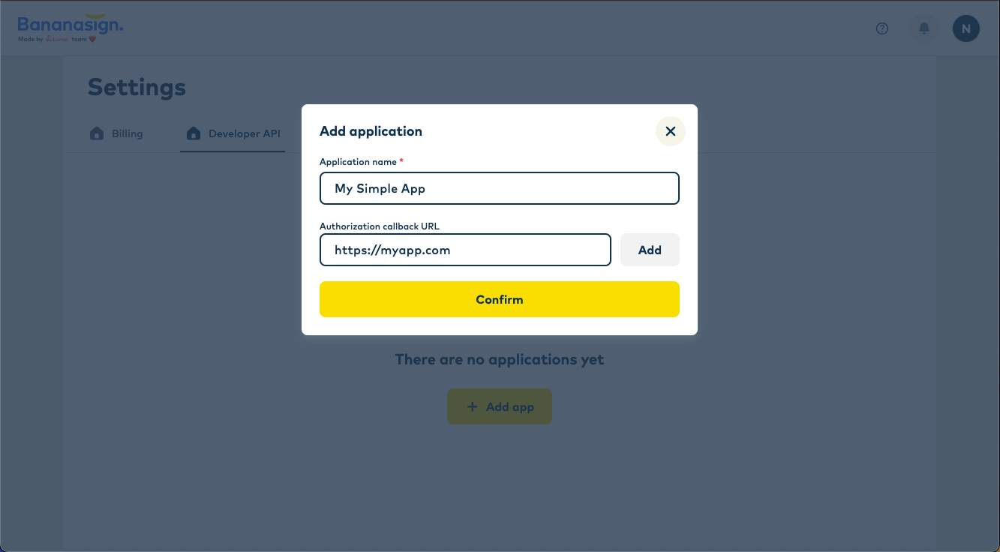

# Creating an Application

Before we begin, we need to create an application on Bananasign in order to get a client ID and client secret.

From [Bananasign Developer API](https://app-auth-staging.bananasign.co/settings/api), click “Add app” and you will be presented with a short form.

After completing this form, you can see the client ID and secret issued to your application.

:::warning
**Client Secret** is displayed only once. Keep it safe!
:::