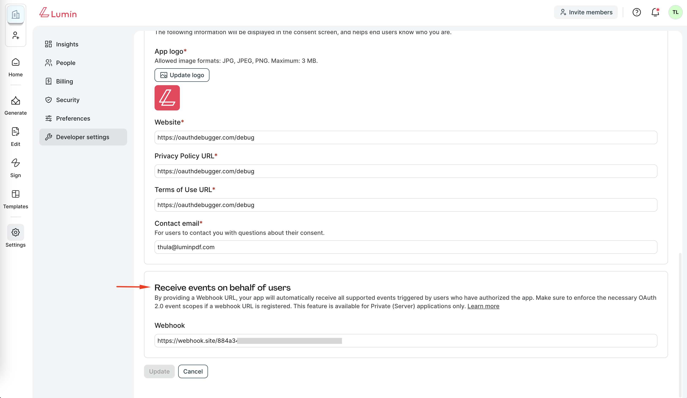
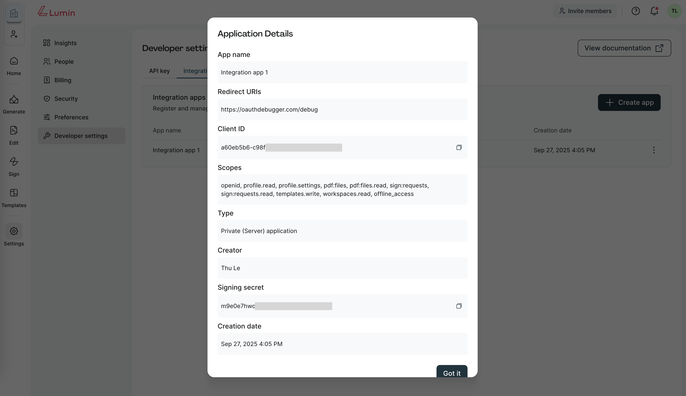

# App Webhooks

**App-level webhooks** are connected to specific OAuth 2.0 applications and deliver events only for users who have authorized your app. Events are limited to the **scopes** granted during OAuth authorization.

This model is best for **multi-tenant integrations**, such as third-party apps or SaaS platforms, where each app should only receive events for its own authorized users.

## Setting up App webhooks
:::info
- Only the **Workspace Owner** can create or update the App webhook URL.
- This feature is only available for **Private (Server) applications**.
:::

To configure App webhooks:

1. Go to **Developer Settings page → Integration apps tab**.
2. Click to edit the app you want to configure, or click **Create app** to create a new app.
3. Under **Receive events on behalf of users** section, enter your Webhook URL (HTTPS required).
4. Click **Save** button.



## Receiving Events

Once your App webhook is configured, Lumin will automatically send **HTTP POST requests** to your endpoint when events occur for authorized users.

App webhooks receive events based on the **[OAuth scopes](/docs/beta/authorization/oauth2-authentication/scopes)** granted by users. For a complete list of available events, see [Supported event types](/docs/api/webhooks/webhook-overview#supported-event-types).

All webhook events follow a consistent JSON structure with additional user context. For detailed payload examples, see [Event payload structure](/docs/api/webhooks/webhook-overview#event-payload-structure).

### Event delivery rules

- **One request per event**: Each event triggers a separate HTTP POST request
- **Real-time delivery**: Events are delivered as they occur
- **User-scoped coverage**: Only events from users who have authorized your app
- **Scope-dependent filtering**: Events are limited to the scopes granted during OAuth authorization. For example, if your app does not enforce or a user does not grant `sign:requests.read`/`sign:requests` scope, you will not receive signature requests events.

## Verify the webhook
Lumin provides a couple of headers on Webhook requests:

**User-Agent**: Sender agent. Always `Lumin Sign API`

**X-Signature**: A hex digest SHA256 signature of the request's JSON payload, generated using your **App's Signing Secret**
You can view your app's signing secret in **Developer Settings → Integration apps → Application details** modal.



**Verification steps**:
1. Read the `X-Signature` header.
2. Compute HMAC-SHA256 with your **App's Signing Secret**.
3. Compare securely with the header value.
4. Reject if mismatch or timestamp expired.

**Example**:
```bash
signing_secret='your_app_signing_secret'
json='{"event": { "event_time": 1694664207595, "event_type": "signature_request_sent" }, "signature_request": { "signature_request_id": "fa5c8a0b0f492d768749333ad6fcc214c111e967", "title": "My first request" } }'

echo -n $json | openssl dgst -sha256 -hmac $signing_secret (X-Signature = 3810cb411041efab279d31698b9584372e5ede9d1641fbb354810f16e51be81c)
```

## Respond to Events

Your webhook endpoint must respond appropriately to ensure reliable event delivery:

#### Success response
- **Return HTTP 200 OK** to acknowledge successful receipt
- **Respond within 30 seconds** to avoid timeout
- **No specific response body required** - empty response is acceptable

```http
HTTP/1.1 200 OK
Content-Type: application/json

{}
```

#### Error handling
- **HTTP 4xx/5xx responses** will trigger retry attempts
- **Timeout responses** (>30 seconds) will be retried
- **Connection failures** will be retried with exponential backoff

For detailed retry schedules and failure handling, see [Retry rules and failure handling](/docs/api/webhooks/webhook-overview#retry-rules-and-failure-handling).