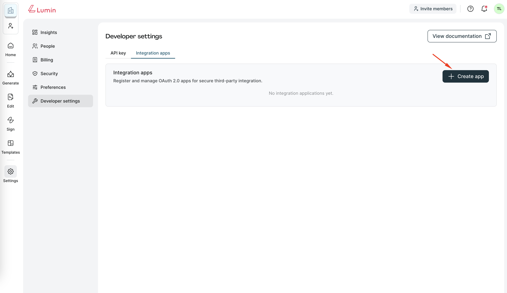
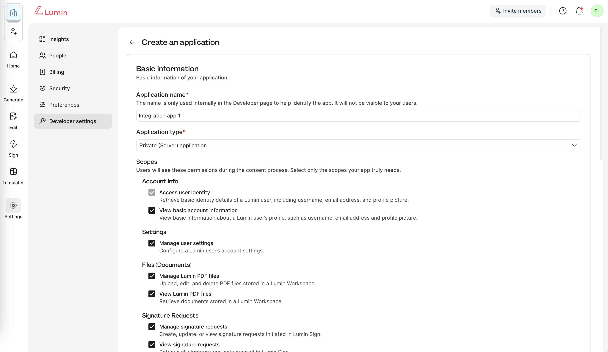
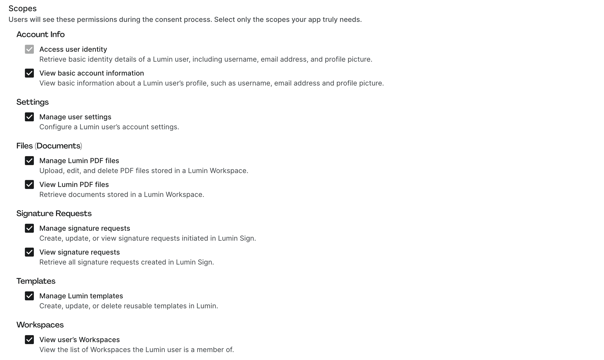
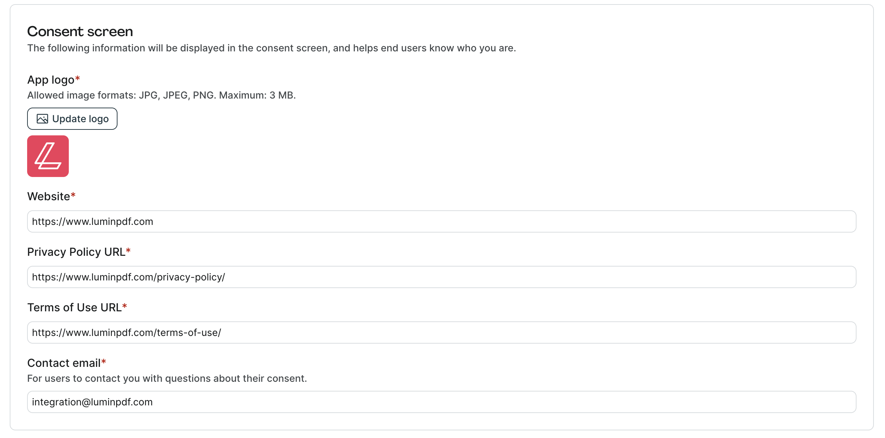
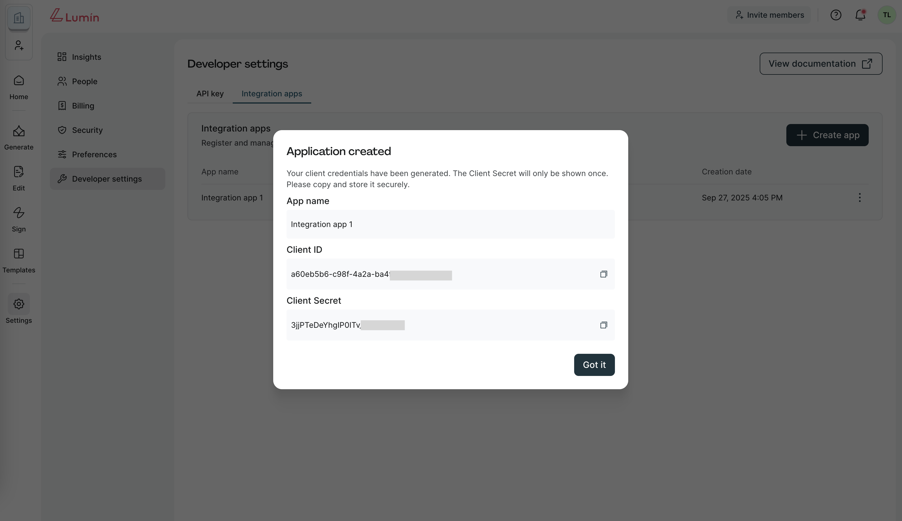

# Creating an OAuth 2.0 application

Before using OAuth 2.0 to integrate with the Lumin APIs, you need to register your application in the Lumin Developer settings page.

## Prerequisites

- You must be a **Workspace Owner** to create integration apps.
- Each Workspace can create up to **5 integration apps**.

## Step-by-step walkthrough

### Step 1: Navigate to Developer Settings page

1. Log in to your Lumin account.
2. Go to **Settings → Developer Settings → Integration apps**.
3. Click **Create app**.

### Step 2: Enter basic information

On the "Create an application" page, fill out the following fields:

- **Application name**: A name to identify your app internally.
- **Application type**: Choose whether your app is a **Public Application** (no client secret, uses PKCE) or a **Private Application** (server-based, with client secret).

:::warning
**Note:** Once you create an application, its type cannot be changed. If you need a different type, you must create a new application.
:::

### Step 3: Select Scopes

Scopes define what data and features your app can access.

- Choose only the scopes your app requires (e.g., User profile, Workspaces, Templates, Signature requests).
- Scopes selected here will appear on the **consent screen** when users authorize your application.

:::info
For the full list and descriptions, see: [OAuth 2.0 Scopes in Lumin](/docs/beta/authorization/oauth2-authentication/scopes)
:::

### Step 4: Configure Redirect URIs

Enter one or more redirect URIs where Lumin will send users after authorization.

**Requirements:**
- Must use `https://` or an app-specific scheme (e.g., `myapp://callback`).
- No wildcards, IP addresses, or relative paths are allowed.
- You can add multiple URIs by separating them with commas.

### Step 5: Configure Consent screen

Fill out the information that users will see when granting your app permissions:

- **App logo** (JPG/PNG, max 3 MB)
- **Website URL**
- **Privacy Policy URL**
- **Terms of Use URL**
- **Contact email** (support or integration contact point)

This ensures users know who is requesting access and how to contact you.

### Step 6: Save and retrieve credentials

1. Click **Create**.
2. After application creation, you'll receive the following credentials:
   - **Client ID** — Required for all OAuth 2.0 flows.
   - **Client Secret** — Issued only for confidential (server-based) apps. Used when exchanging authorization codes and refresh tokens.
3. **Store these credentials securely in a secret manager**. Do not hardcode them into your source code or commit them to repositories.

That's it — you've successfully created your first OAuth 2.0 application in Lumin.

## Next steps

Use your credentials to implement one of the supported OAuth 2.0 flows:

- **[Private Authorization Code Grant](./private-authorization-code)** — for confidential clients.
- **[Public Authorization Code Grant with PKCE](./public-authorization-code)** — for public clients.