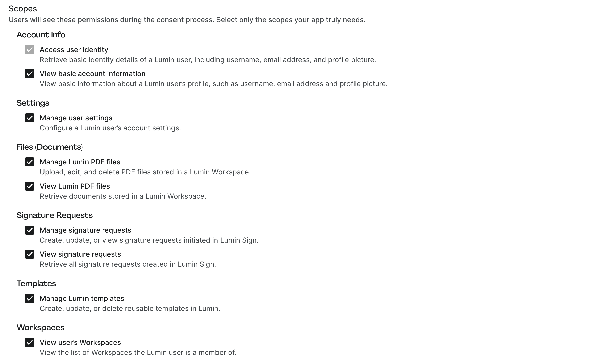

# Scopes

When creating an OAuth 2.0 application in Lumin, you must define the **scopes** the app requires. **Scopes** determine the level of access an app has to a user's data and resources.

We recommend requesting **only the scopes your app actually needs** to ensure minimal permissions for security and a clearer consent experience for end users.

## Selecting scopes

- During app creation, scopes can be selected in the **Scopes** section.
- Each scope corresponds to a specific resource, with examples given: profile, templates, PDF files, signature requests.
- The selected scopes will appear on the **user consent screen**, informing the user exactly what the app can access.

## Viewing scopes for an existing app

- Scopes assigned to an existing application can be viewed by opening the **Application details** modal in **Developer Settings → Integration apps**.
- From there, you can view and copy the exact scope string for use in OAuth requests.

## Supported scopes in Lumin

Lumin provides scopes across common resources such as **Account**, **Workspaces**, **Files (Documents)**, **Signature Requests**, and **Templates**.

| Category | Scope | Description |
|----------|-------|-------------|
| **Account** | `openid` | Retrieve basic identity details of a Lumin user, including username, email address, and profile picture. |
| **Account** | `offline_access` | Request a refresh token to maintain access when the user is not actively signed in (only available for Private (Server) apps). |
| **Account** | `profile.read` | View basic information about a user's profile, such as username, email address and profile picture. |
| **Account** | `profile.settings` | Manage a user's account settings. |
| **Workspace** | `workspaces.read` | View the list of Workspaces a user belongs to. |
| **Templates** | `templates.write` | Create, update, or delete reusable templates in Lumin. |
| **Files (documents stored in Lumin PDF)** | `pdf:files` | Upload, edit, and delete PDF files stored in a Lumin Workspace. |
| **Files (documents stored in Lumin PDF)** | `pdf:files.read` | Retrieve documents stored in a Lumin Workspace. |
| **Signature Requests** | `sign:requests` | Create, update, or view signature requests initiated in Lumin Sign. |
| **Signature Requests** | `sign:requests.read` | Retrieve signature requests created in Lumin Sign. |

## Best practices

- Request the **minimum set of scopes** necessary for your app's functionality.
- For apps that don't need long-term access, avoid `offline_access` to reduce risk.
- Regularly review the scopes in your app to ensure they align with your use case.
