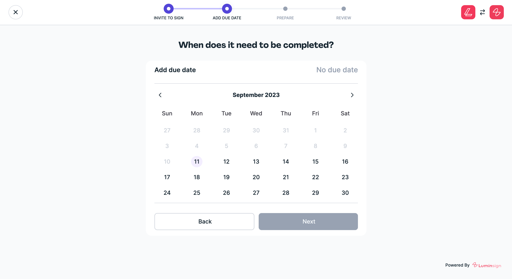

# Launch Signing Flow

There are a few more steps for the customer to prepare there document for signing. Luckily, Lumin Sign handles everything from this point onwards. Just load the Lumin Sign iframe using the unique document identifier:

:::caution
Prerequisites: You need to obtain a bearer token from [Getting a Bearer Token](/docs/beta/category/getting-an-bearer-token)
:::

```html
  <iframe width="100%" height="100%"
   src="https://app-auth-staging.bananasign.co/embed/WNLW4u4dBOOn?token={accessToken}"
   title="Iframe Upload"
   frameborder="0"
   allow="autoplay; clipboard-write; encrypted-media; picture-in-picture"
   id="bananaSignIframe"
   allowfullscreen=""
   style="visibility: visible;">
  </iframe>
```

Lumin Sign will handle the rest. The customer will be able to step through the setup process, preparing their document for signing.




Congratulations 🎉 You have now added a fully compliant signing flow to your application
