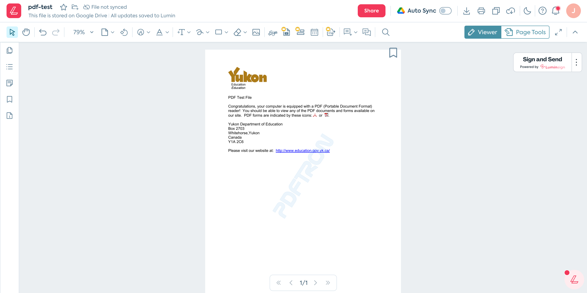
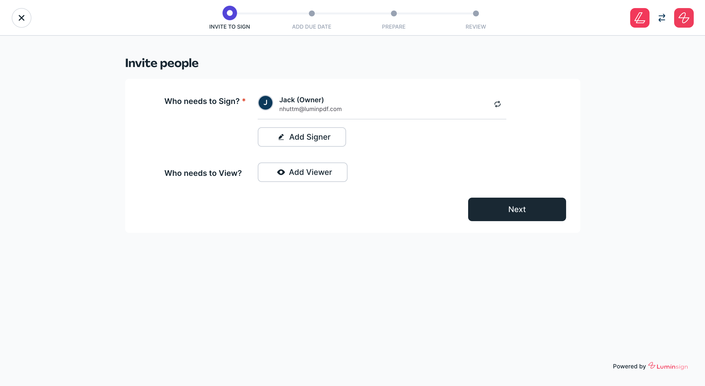

# Starting the Signing Flow

The Lumin Sign signing workflow is normally started when a customer in your application clicks an action button. On Lumin PDF, the signing flow can be launched by clicking our **Sign and Send** button.



## Start Page

The application (in this case Lumin PDF) often needs to collect some additional information about the document before launching the signing flow. The most important information is the list of email addresses that will need to sign the document.


Lumin Sign provides a [library](/docs/beta/client/sendAndSign) that can be used to collect this information. Of course, you can build any widget to collect this information, or skip this step altogether.



The customer uses this page to select the people who need to sign the document. They can also select who will be able to view the document during the signing process, and download the document once it is complete.

:::tip This page is customizable
This step in the Lumin Sign setup flow is 100% customizable. The app developer can adapt the Lumin Sign widget or they can skip this step altogether. The app developer can provide their own email address suggestion or pre-fill the input field, as this page is controlled by the app developer.
:::


The React element renders a simple HTML page:

```html
<div class="MuiDialog-container MuiDialog-scrollPaper" role="none presentation" tabindex="-1" style="opacity: 1; transition: opacity 225ms cubic-bezier(0.4, 0, 0.2, 1) 0ms;">
   <div class="MuiPaper-root MuiDialog-paper MuiDialog-paperScrollPaper MuiDialog-paperWidthFalse MuiDialog-paperFullScreen MuiPaper-elevation24 MuiPaper-rounded" role="dialog">
      <div class="sc-9ddl5m-8 jOkPXs">
         <p class="sc-9ddl5m-3 hvTgrj">Invite people</p>
         <div class="sc-9ddl5m-10 egrfpZ">
            <p class="sc-9ddl5m-3 hvTgrj" style="font-size: 16px;">Who needs to Sign?<span style="color: red;"> *</span></p>
            <div class="sc-9ddl5m-11 imvyuE">
               <div class="sc-9ddl5m-12 hWaOVb">
                  <div class="SignerViewerModalContent__user-info">
                     <div style="display: flex;">
                        <div class="SignerViewerModalContent__user-info-avatar MaterialAvatar MaterialAvatar__border MaterialAvatar__border--circle">
                           <div class="MuiAvatar-root MuiAvatar-circular MaterialAvatar__container  MuiAvatar-colorDefault" style="background-color: var(--color-success-50); width: 32px; height: 32px; font-size: 14px;">MF</div>
                        </div>
                        <div class="SignerViewerModalContent__user-info-text">
                           <p>Max Ferguson (Owner)</p>
                           <p>max@luminpdf.com</p>
                        </div>
                     </div>
                     <div class="SignerViewerModalContent__user-info-delete-button-wrapper">
                        <span><button class="MuiButtonBase-root MuiButton-root MuiButton-text ViewerButtonMaterial ViewerButtonLumin square ViewerActionButton   inactive icon" tabindex="0" type="button" href="" data-element="" aria-label="none" id="">
                        <span class="MuiButton-label">
                        <span class="ViewerButtonLumin__content"><i class="icon icon-repeat  icon__20" style="font-size: 20px;"></i></span></span><span class="MuiTouchRipple-root"></span></button></span>
                     </div>
                  </div>
               </div>
               <button class="MuiButtonBase-root MuiButton-root MuiButton-text sc-9ddl5m-14 gLOlwJ" tabindex="0" type="button">
               <span class="MuiButton-label">
               <i class="icon icon-banana-sign icon__16" style="font-size: 16px;"></i>
               <span>Add Signer</span></span>
               <span class="MuiTouchRipple-root"></span></button>
            </div>
            <p class="sc-9ddl5m-3 hvTgrj" style="font-size: 16px;">Who needs to View?</p>
            <div class="sc-9ddl5m-11 imvyuE"><button class="MuiButtonBase-root MuiButton-root MuiButton-text sc-9ddl5m-14 gLOlwJ" tabindex="0" type="button">
               <span class="MuiButton-label"><i class="icon icon-eye-view icon__16" style="font-size: 16px;"></i><span>Add Viewer</span></span>
               <span class="MuiTouchRipple-root"></span></button>
            </div>
            <button class="MuiButtonBase-root MuiButton-root MuiButton-text sc-9ddl5m-15 kRSEBo" tabindex="0" type="button" data-lumin-btn-name="nextToAddDueDate" data-lumin-btn-purpose="Next to add due date step of Bananasign"><span class="MuiButton-label">Next</span><span class="MuiTouchRipple-root"></span></button>
         </div>
      </div>
   </div>
</div>
```
