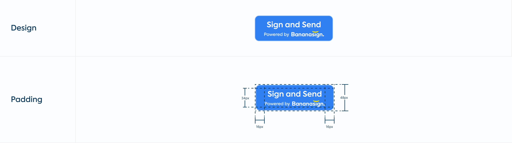
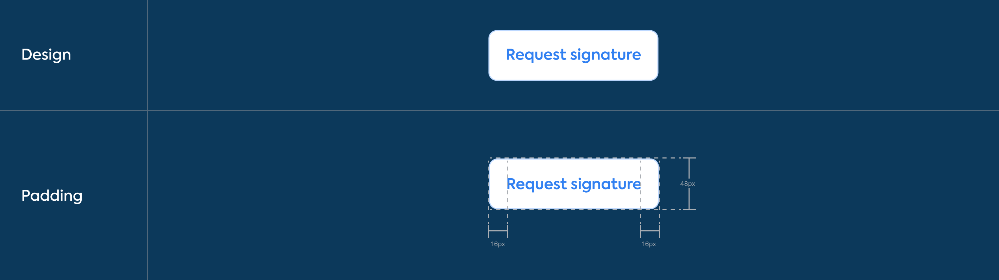

# Send and Sign Branding Guidelines

Use Send And Sign button with the basic ```bananasign:document.create``` scopes and incorporate the following standard buttons in your web app:


## Light Mode

Logo resources:

[Full size](img/guidelines/light/logo.svg "download")

[Small size](img/guidelines/light/logo_small.svg "download")

### Full size button

#### With bananasign logo


#### Without bananasign logo


### Small size

#### With bananasign logo


#### Without bananasign logo


### Typo


### Color


## Dark Mode

Logo resources:

[Full size](img/guidelines/dark/logo.svg "download")

[Small size](img/guidelines/dark/logo_small.svg "download")

### Full size button

#### With bananasign logo


#### Without bananasign logo


### Small size

#### With bananasign logo


#### Without bananasign logo


### Typo


### Color


## Incorrect button design

