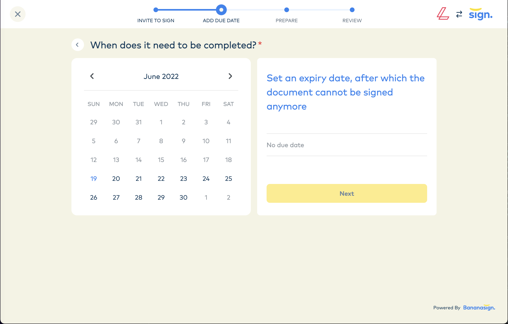

# Launch Signing Flow

There are a few more steps for the customer to prepare there document for signing. Luckily, Bananasign handles everything from this point onwards. Just load the Bananasign iframe using the unique contract identifier:

```html 
  <iframe width="100%" height="100%" 
   src="https://lxb.bananasign.co/embed/5tyeu4il7x"
   title="Iframe Upload" 
   frameborder="0" 
   allow="autoplay; clipboard-write; encrypted-media; picture-in-picture" 
   id="bananaSignIframe" 
   allowfullscreen="" 
   style="visibility: visible;">
  </iframe>
```

Bananasign will handle the rest. The customer will be able to step through the setup process, preparing their document for signing.




Congratulations 🎉 You have now added a fully compliant signing flow to your application 